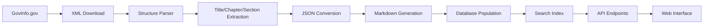

# 🇺🇸 USA Code Database - Comprehensive Project Plan

## 🎯 **Project Overview**

**Mission**: Create the world's most comprehensive, open-source United States Code database - transforming all 54 federal law titles into a modern, AI-ready legal knowledge system.

**Vision**: Democratize access to US federal law, enabling legal innovation, research, and civic engagement through structured, searchable, and accessible legal data.

---

## 📊 **US Code Structure Analysis**

### 🏛️ **Current US Code Organization (2024)**

The United States Code is organized into **54 titles** covering all areas of federal law:

#### **📋 Complete Title List**

| Title | Subject Matter | Estimated Size |
|-------|---------------|----------------|
| **Title 1** | General Provisions | Small |
| **Title 2** | The Congress | Medium |
| **Title 3** | The President | Small |
| **Title 4** | Flag and Seal, Seat of Government, and the States | Small |
| **Title 5** | Government Organization and Employees | Large |
| **Title 6** | Domestic Security | Medium |
| **Title 7** | Agriculture | Large |
| **Title 8** | Aliens and Nationality | Large |
| **Title 9** | Arbitration | Small |
| **Title 10** | Armed Forces | Very Large |
| **Title 11** | Bankruptcy | Medium |
| **Title 12** | Banks and Banking | Large |
| **Title 13** | Census | Medium |
| **Title 14** | Coast Guard | Medium |
| **Title 15** | Commerce and Trade | Very Large |
| **Title 16** | Conservation | Large |
| **Title 17** | Copyrights | Medium |
| **Title 18** | Crimes and Criminal Procedure | Very Large |
| **Title 19** | Customs Duties | Large |
| **Title 20** | Education | Large |
| **Title 21** | Food and Drugs | Large |
| **Title 22** | Foreign Relations and Intercourse | Large |
| **Title 23** | Highways | Large |
| **Title 24** | Hospitals and Asylums | Small |
| **Title 25** | Indians | Large |
| **Title 26** | Internal Revenue Code | Very Large |
| **Title 27** | Intoxicating Liquors | Medium |
| **Title 28** | Judiciary and Judicial Procedure | Large |
| **Title 29** | Labor | Large |
| **Title 30** | Mineral Lands and Mining | Large |
| **Title 31** | Money and Finance | Large |
| **Title 32** | National Guard | Medium |
| **Title 33** | Navigation and Navigable Waters | Large |
| **Title 34** | Crime Control and Law Enforcement | Large |
| **Title 35** | Patents | Medium |
| **Title 36** | Patriotic and National Observances | Medium |
| **Title 37** | Pay and Allowances of the Uniformed Services | Medium |
| **Title 38** | Veterans' Benefits | Large |
| **Title 39** | Postal Service | Medium |
| **Title 40** | Public Buildings, Property, and Works | Large |
| **Title 41** | Public Contracts | Large |
| **Title 42** | The Public Health and Welfare | Very Large |
| **Title 43** | Public Lands | Large |
| **Title 44** | Public Printing and Documents | Medium |
| **Title 45** | Railroads | Large |
| **Title 46** | Shipping | Large |
| **Title 47** | Telecommunications | Large |
| **Title 48** | Territories and Insular Possessions | Large |
| **Title 49** | Transportation | Very Large |
| **Title 50** | War and National Defense | Large |
| **Title 51** | National and Commercial Space Programs | Medium |
| **Title 52** | Voting and Elections | Large |
| **Title 53** | Small Business | Medium |
| **Title 54** | National Park Service and Related Programs | Large |

### 🏗️ **Hierarchical Structure**

Each Title follows this structure:
```
Title XX - Subject Name
├── Chapter 1 - Chapter Name
│   ├── Subchapter A (if applicable)
│   │   ├── Section 101 - Section Name
│   │   ├── Section 102 - Section Name
│   │   └── ...
│   ├── Subchapter B (if applicable)
│   └── ...
├── Chapter 2 - Chapter Name
└── ...
```

---

## 🎯 **Project Architecture**

### 📁 **Proposed Directory Structure**

```
USA_Code/
├── README.md                          # Project overview and vision
├── CONTRIBUTING.md                     # Contribution guidelines
├── LICENSE                            # MIT License
├── .gitignore                         # Git ignore rules
├── docs/                              # Documentation
│   ├── quick-start.md                 # Getting started guide
│   ├── structure-guide.md             # US Code structure explanation
│   ├── api-documentation.md           # API docs (future)
│   └── legal-disclaimer.md            # Legal disclaimers
├── scripts/                           # Automation tools
│   ├── download_uscode.sh             # Main download script
│   ├── convert_to_markdown.sh         # Conversion tools
│   ├── validate_structure.sh          # Validation scripts
│   ├── update_database.sh             # Update mechanisms
│   └── monitor_progress.sh            # Progress tracking
├── data/                              # Raw and processed data
│   ├── xml/                           # Original XML files
│   ├── json/                          # Structured JSON data
│   └── markdown/                      # Converted Markdown files
├── database/                          # Database files (future)
│   ├── sqlite/                        # SQLite database
│   └── postgresql/                    # PostgreSQL schema
├── Title_01_General_Provisions/       # Individual title folders
│   ├── README.md                      # Title overview
│   ├── title_info.json               # Metadata
│   ├── Chapter_01_Rules_of_Construction/
│   │   ├── chapter_info.json         # Chapter metadata
│   │   ├── Section_0001.xml          # Original XML
│   │   ├── Section_0001.json         # Structured JSON
│   │   ├── Section_0001.md           # Markdown version
│   │   └── ...
│   ├── Chapter_02_Acts_and_Resolutions/
│   └── ...
├── Title_02_The_Congress/
├── Title_03_The_President/
├── ...
├── Title_54_National_Park_Service/
└── .github/                           # GitHub configuration
    ├── workflows/                     # CI/CD workflows
    ├── ISSUE_TEMPLATE/               # Issue templates
    └── PULL_REQUEST_TEMPLATE.md      # PR template
```

### 🔄 **Data Flow Architecture**



---

## 🛠️ **Technical Implementation Plan**

### 📥 **Phase 1: Data Acquisition (Weeks 1-2)**

#### **1.1 Source Analysis**
- **Primary Source**: [GovInfo.gov](https://www.govinfo.gov/app/collection/uscode)
- **Format**: USLM XML (United States Legislative Markup)
- **API Access**: GovInfo API for programmatic access
- **Bulk Download**: Available for entire US Code

#### **1.2 Download Strategy**
```bash
# Main download script structure
download_uscode.sh:
├── Fetch title list from GovInfo API
├── For each title (1-54):
│   ├── Create title directory
│   ├── Download title XML file
│   ├── Parse chapter structure
│   ├── For each chapter:
│   │   ├── Create chapter directory
│   │   ├── Extract sections
│   │   └── Save individual section files
│   └── Generate title metadata
└── Create comprehensive index
```

#### **1.3 File Naming Convention**
- **Titles**: `Title_XX_Subject_Name/`
- **Chapters**: `Chapter_XXX_Chapter_Name/`
- **Sections**: `Section_XXXX.xml`, `Section_XXXX.json`, `Section_XXXX.md`

### 🔄 **Phase 2: Data Processing (Weeks 3-4)**

#### **2.1 XML Parsing**
- Parse USLM XML structure
- Extract hierarchical relationships
- Preserve legal formatting and references
- Handle cross-references and citations

#### **2.2 Structured Data Generation**
```json
{
  "title": {
    "number": 15,
    "name": "Commerce and Trade",
    "chapters": [
      {
        "number": 1,
        "name": "Monopolies and Combinations in Restraint of Trade",
        "sections": [
          {
            "number": 1,
            "heading": "Trusts, etc., in restraint of trade illegal",
            "text": "Every contract, combination...",
            "citations": ["15 USC 1"],
            "cross_references": ["Section 2", "Section 3"],
            "effective_date": "1890-07-02",
            "amendments": [...]
          }
        ]
      }
    ]
  }
}
```

#### **2.3 Markdown Conversion**
- Convert structured data to readable Markdown
- Preserve legal formatting
- Add navigation links
- Include metadata headers

### 🗄️ **Phase 3: Database Implementation (Weeks 5-6)**

#### **3.1 SQLite Database**
```sql
-- Core tables structure
CREATE TABLE titles (
    id INTEGER PRIMARY KEY,
    number INTEGER UNIQUE,
    name TEXT,
    description TEXT,
    last_updated DATE
);

CREATE TABLE chapters (
    id INTEGER PRIMARY KEY,
    title_id INTEGER,
    number INTEGER,
    name TEXT,
    description TEXT,
    FOREIGN KEY (title_id) REFERENCES titles(id)
);

CREATE TABLE sections (
    id INTEGER PRIMARY KEY,
    chapter_id INTEGER,
    number INTEGER,
    heading TEXT,
    content TEXT,
    citations TEXT,
    cross_references TEXT,
    effective_date DATE,
    FOREIGN KEY (chapter_id) REFERENCES chapters(id)
);

-- Full-text search
CREATE VIRTUAL TABLE sections_fts USING fts5(
    heading, content, citations
);
```

#### **3.2 PostgreSQL Schema**
- Extended schema for production use
- Advanced indexing for performance
- Full-text search capabilities
- JSON support for complex structures

### 🔍 **Phase 4: Search & API (Weeks 7-8)**

#### **4.1 Search Implementation**
- Full-text search across all sections
- Faceted search by title, chapter, date
- Boolean search operators
- Proximity and phrase searching

#### **4.2 REST API**
```
GET /api/v1/titles                    # List all titles
GET /api/v1/titles/{id}              # Get specific title
GET /api/v1/titles/{id}/chapters     # Get title chapters
GET /api/v1/chapters/{id}/sections   # Get chapter sections
GET /api/v1/sections/{id}            # Get specific section
GET /api/v1/search?q={query}        # Search all content
```

---

## 📊 **Data Specifications**

### 📏 **Estimated Dataset Size**
- **Total Titles**: 54
- **Estimated Chapters**: ~2,000
- **Estimated Sections**: ~50,000
- **Raw XML Size**: ~500MB
- **JSON Data**: ~1GB
- **Markdown Files**: ~800MB
- **Total Repository Size**: ~2.5GB

### 📋 **File Format Standards**

#### **XML Files** (Original)
- USLM (United States Legislative Markup) format
- Preserved exactly as downloaded from GovInfo
- Contains all legal formatting and metadata

#### **JSON Files** (Structured)
- Hierarchical structure matching legal organization
- Standardized field names and types
- Cross-references and citations preserved
- Metadata included (dates, amendments, etc.)

#### **Markdown Files** (Human-Readable)
- Clean, readable format for documentation
- Navigation links between sections
- Metadata headers with YAML front matter
- Preserved legal formatting where possible

---

## 🚀 **Development Roadmap**

### 🏗️ **Phase 1: Foundation (Weeks 1-2)**
- [x] Project planning and architecture design
- [ ] Repository structure creation
- [ ] Download script development
- [ ] Initial data acquisition (sample titles)
- [ ] XML parsing implementation

### 📊 **Phase 2: Data Processing (Weeks 3-4)**
- [ ] Complete US Code download (all 54 titles)
- [ ] JSON conversion pipeline
- [ ] Markdown generation system
- [ ] Data validation and quality assurance
- [ ] Metadata extraction and organization

### 🗄️ **Phase 3: Database Systems (Weeks 5-6)**
- [ ] SQLite database implementation
- [ ] PostgreSQL schema design
- [ ] Data import and indexing
- [ ] Full-text search setup
- [ ] Performance optimization

### 🔍 **Phase 4: Search & API (Weeks 7-8)**
- [ ] RESTful API development
- [ ] Advanced search capabilities
- [ ] API documentation
- [ ] Rate limiting and security
- [ ] Testing and validation

### 🌐 **Phase 5: Web Interface (Weeks 9-10)**
- [ ] Web application development
- [ ] Search interface design
- [ ] Browse and navigation features
- [ ] Mobile-responsive design
- [ ] User experience optimization

### 🤖 **Phase 6: AI Integration (Weeks 11-12)**
- [ ] Vector embedding generation
- [ ] RAG (Retrieval-Augmented Generation) system
- [ ] Legal AI chatbot
- [ ] Semantic search capabilities
- [ ] Legal analysis tools

---

## 🛠️ **Technical Requirements**

### 💻 **Development Environment**
- **Operating System**: macOS, Linux, or WSL
- **Shell**: bash/zsh
- **Languages**: Python 3.8+, JavaScript/Node.js
- **Tools**: curl, jq, xmllint, pandoc

### 📦 **Dependencies**
```bash
# System tools
brew install curl jq xmllint pandoc

# Python packages
pip install requests beautifulsoup4 lxml pandas sqlalchemy

# Node.js packages
npm install express axios cheerio markdown-it
```

### 🗄️ **Database Requirements**
- **SQLite**: For local development and testing
- **PostgreSQL**: For production deployment
- **Redis**: For caching and session management
- **Elasticsearch**: For advanced search features

---

## 📋 **Quality Assurance Plan**

### ✅ **Data Validation**
- **Structure Validation**: Ensure all titles/chapters/sections are captured
- **Content Validation**: Verify text accuracy against source
- **Cross-Reference Validation**: Check all internal links and citations
- **Metadata Validation**: Ensure all dates and references are correct

### 🧪 **Testing Strategy**
- **Unit Tests**: Individual component testing
- **Integration Tests**: End-to-end workflow testing
- **Performance Tests**: Large dataset handling
- **API Tests**: All endpoints and error handling

### 📊 **Monitoring & Metrics**
- **Download Success Rate**: Track failed downloads
- **Conversion Accuracy**: Monitor parsing errors
- **Search Performance**: Query response times
- **API Usage**: Track endpoint usage and errors

---

## 🤝 **Community Engagement Plan**

### 👥 **Target Audiences**
- **Legal Professionals**: Lawyers, judges, legal researchers
- **Developers**: Legal tech developers, civic tech enthusiasts
- **Academics**: Law professors, legal scholars, students
- **Government**: Federal agencies, policy makers
- **Citizens**: Engaged citizens interested in federal law

### 📢 **Outreach Strategy**
- **Legal Tech Communities**: Announce in legal tech forums
- **Academic Partnerships**: Collaborate with law schools
- **Government Engagement**: Connect with federal agencies
- **Developer Communities**: Share in open source communities
- **Social Media**: Promote on Twitter, LinkedIn, Reddit

### 🏆 **Contribution Recognition**
- **Contributors Page**: Recognize all contributors
- **Special Recognition**: Highlight significant contributions
- **Community Awards**: Annual recognition program
- **Speaking Opportunities**: Conference presentations

---

## ⚖️ **Legal & Compliance Considerations**

### 📜 **Data Rights**
- **Public Domain**: US Code is public domain
- **No Copyright Issues**: Federal law is not copyrightable
- **Attribution**: Credit GovInfo.gov as data source
- **Terms Compliance**: Follow GovInfo terms of use

### 🛡️ **Legal Disclaimers**
- **Not Legal Advice**: Clear disclaimer about informational use
- **Official Source**: Direct users to official sources for legal decisions
- **Accuracy Disclaimer**: Note potential for errors or outdated information
- **Liability Limitation**: Standard open source liability limitations

### 🔒 **Privacy & Security**
- **No Personal Data**: No collection of personal information
- **Anonymous Usage**: No user tracking or analytics
- **Secure API**: Rate limiting and abuse prevention
- **HTTPS Only**: Secure data transmission

---

## 💰 **Resource Requirements**

### 👨‍💻 **Human Resources**
- **Project Lead**: Overall coordination and vision
- **Backend Developer**: API and database development
- **Frontend Developer**: Web interface development
- **Legal Consultant**: Legal accuracy and compliance
- **DevOps Engineer**: Infrastructure and deployment

### 💾 **Infrastructure**
- **Development**: Local development environment
- **Staging**: Cloud testing environment
- **Production**: Scalable cloud infrastructure
- **CDN**: Content delivery network for global access
- **Monitoring**: Application and infrastructure monitoring

### 💸 **Estimated Costs**
- **Development**: Volunteer/open source contributions
- **Infrastructure**: $100-500/month (depending on usage)
- **Domain & SSL**: $50/year
- **Legal Consultation**: $2,000-5,000 one-time
- **Marketing**: $1,000-3,000/year

---

## 📈 **Success Metrics**

### 🎯 **Primary KPIs**
- **Data Completeness**: 100% of US Code captured
- **Conversion Accuracy**: >99% accurate text conversion
- **Search Performance**: <100ms average response time
- **API Reliability**: >99.9% uptime
- **Community Engagement**: 100+ contributors in first year

### 📊 **Secondary Metrics**
- **Repository Stars**: 1,000+ GitHub stars
- **API Usage**: 10,000+ API calls per month
- **Web Traffic**: 50,000+ monthly unique visitors
- **Educational Impact**: 10+ academic partnerships
- **Media Coverage**: 5+ major tech/legal publications

---

## 🔮 **Future Vision**

### 🌟 **Long-term Goals**
- **Comprehensive Legal Database**: Include regulations, case law, treaties
- **International Expansion**: Add other countries' legal codes
- **AI Legal Assistant**: Advanced legal AI capabilities
- **Educational Platform**: Interactive legal learning tools
- **Policy Impact**: Influence government transparency initiatives

### 🚀 **Innovation Opportunities**
- **Legal Analytics**: Trend analysis and legal insights
- **Automated Updates**: Real-time legal change tracking
- **Comparative Analysis**: Cross-jurisdictional legal comparison
- **Predictive Modeling**: Legal outcome prediction tools
- **Citizen Engagement**: Simplified legal information for public

---

## 📞 **Contact & Support**

### 🤝 **Project Leadership**
- **Project Creator**: [Your Name]
- **Email**: [your-email@example.com]
- **GitHub**: [@yourusername](https://github.com/yourusername)
- **Twitter**: [@yourusername](https://twitter.com/yourusername)

### 💬 **Community Channels**
- **GitHub Issues**: Bug reports and feature requests
- **GitHub Discussions**: General project discussion
- **Discord/Slack**: Real-time community chat (future)
- **Mailing List**: Project announcements (future)

---

<div align="center">

## 🌟 **Building the Future of Legal Technology** 🌟

**"Democracy dies in darkness. Let's bring light to the law."**

This project will democratize access to US federal law, enable legal innovation, and foster civic engagement through open source technology.

**Ready to change the world of legal technology?** 🚀⚖️🇺🇸

</div>

---

*Last updated: January 2024*
*Project Status: Planning Phase*
*Next Milestone: Repository Setup & Initial Data Acquisition*
