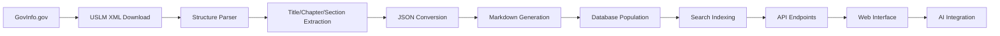

# 🇺🇸 United States Code Database - Open Legal Knowledge Project

<div align="center">

[](https://opensource.org/licenses/MIT)
[](https://github.com/yourusername/usa-code-db)
[](https://github.com/yourusername/usa-code-db)
[](https://github.com/yourusername/usa-code-db)

**Democratizing Access to United States Federal Law Through Open Source**

*Building the future of American legal AI, one statute at a time* ⚖️🇺🇸

[🚀 Getting Started](#-getting-started) • [📊 Dataset](#-dataset-overview) • [🎯 Vision](#-project-vision) • [🤝 Contributing](#-contributing) • [📚 Documentation](#-documentation)

</div>

---

## 🌟 **Project Vision**

> **"The law belongs to the people. Federal statutes should be accessible, searchable, and understandable for every American citizen."**

**🎯 This is Phase 1 of the IuLex Open Knowledge Project** - a collaborative repository designed to be cloned, worked on, and contributed back to. We're transforming all 54 federal law titles into structured data as the foundation for future knowledge databases and graphs.

**📋 How to Contribute**: Clone this repository, download and process US Code titles using our automation scripts, validate data quality, and submit pull requests. This is collaborative knowledge building at scale.

### 🎯 **Our Mission - Phase 1 Focus**
- **Create Clone-able Federal Law Repository**: Build a repository anyone can clone and improve
- **Democratize US Code Access**: Make federal law processing collaborative and transparent
- **Prepare for Knowledge Graphs**: Structure data for future interconnected databases
- **Enable Mass Collaboration**: Make it easy for anyone to contribute to federal law digitization
- **Build AI-Ready Foundation**: Prepare structured data for Phase 2 knowledge systems

### 🚀 **Phase 2 Vision**: After Phase 1 completion, we'll create:
- **Federal Knowledge Databases**: Enterprise-grade PostgreSQL and graph databases
- **Legal Intelligence Systems**: AI-powered legal research and analysis platforms
- **Cross-Jurisdictional Knowledge Graphs**: Connections between federal, state, and international law

---

## 🚀 **Getting Started**

### Quick Start
```bash
# Clone this collaborative federal law repository
git clone https://github.com/yourusername/usa-code-db.git
cd usa-code-db

# This repo is designed for mass collaboration - see PROJECT_MAP.md for navigation

# Download all 54 titles of US Code
cd scripts
./download_uscode.sh

# Convert to structured JSON format
./convert_to_json.sh

# Generate human-readable Markdown
./convert_to_markdown.sh
```

### Prerequisites
- **bash/zsh** shell
- **curl** for downloading
- **jq** for JSON processing (optional)
- **xmllint** for XML parsing (optional)
- **~3GB disk space** for complete dataset

---

## 📊 **Dataset Overview**

### 📈 **Current Status**
| Component | Status | Count | Size |
|-----------|--------|-------|------|
| 🏛️ **Titles Available** | 📅 Planned | 54/54 | ~2.5GB |
| 📄 **XML Files** | 📅 Planned | 54 files | ~500MB |
| 📊 **JSON Data** | 📅 Planned | ~50,000 sections | ~1GB |
| 📖 **Markdown Files** | 📅 Planned | ~50,000 files | ~800MB |
| 🗃️ **SQLite Database** | 📅 Planned | 1 database | ~200MB |
| 🐘 **PostgreSQL Schema** | 📅 Planned | Full schema | - |
| 🕸️ **Knowledge Graph** | 📅 Planned | Legal relationships | - |
| 🤖 **RAG System** | 📅 Planned | AI legal assistant | - |

### 🏛️ **Complete Title Coverage**

Our comprehensive collection covers **all 54 titles** of the United States Code:

<details>
<summary><strong>📋 Click to view all 54 titles</strong></summary>

| Title | Subject | Size |
|-------|---------|------|
| **Title 1** | General Provisions | Small |
| **Title 2** | The Congress | Medium |
| **Title 3** | The President | Small |
| **Title 4** | Flag and Seal, Seat of Government, and the States | Small |
| **Title 5** | Government Organization and Employees | Large |
| **Title 6** | Domestic Security | Medium |
| **Title 7** | Agriculture | Large |
| **Title 8** | Aliens and Nationality | Large |
| **Title 9** | Arbitration | Small |
| **Title 10** | Armed Forces | Very Large |
| **Title 11** | Bankruptcy | Medium |
| **Title 12** | Banks and Banking | Large |
| **Title 13** | Census | Medium |
| **Title 14** | Coast Guard | Medium |
| **Title 15** | Commerce and Trade | Very Large |
| **Title 16** | Conservation | Large |
| **Title 17** | Copyrights | Medium |
| **Title 18** | Crimes and Criminal Procedure | Very Large |
| **Title 19** | Customs Duties | Large |
| **Title 20** | Education | Large |
| **Title 21** | Food and Drugs | Large |
| **Title 22** | Foreign Relations and Intercourse | Large |
| **Title 23** | Highways | Large |
| **Title 24** | Hospitals and Asylums | Small |
| **Title 25** | Indians | Large |
| **Title 26** | Internal Revenue Code | Very Large |
| **Title 27** | Intoxicating Liquors | Medium |
| **Title 28** | Judiciary and Judicial Procedure | Large |
| **Title 29** | Labor | Large |
| **Title 30** | Mineral Lands and Mining | Large |
| **Title 31** | Money and Finance | Large |
| **Title 32** | National Guard | Medium |
| **Title 33** | Navigation and Navigable Waters | Large |
| **Title 34** | Crime Control and Law Enforcement | Large |
| **Title 35** | Patents | Medium |
| **Title 36** | Patriotic and National Observances | Medium |
| **Title 37** | Pay and Allowances of the Uniformed Services | Medium |
| **Title 38** | Veterans' Benefits | Large |
| **Title 39** | Postal Service | Medium |
| **Title 40** | Public Buildings, Property, and Works | Large |
| **Title 41** | Public Contracts | Large |
| **Title 42** | The Public Health and Welfare | Very Large |
| **Title 43** | Public Lands | Large |
| **Title 44** | Public Printing and Documents | Medium |
| **Title 45** | Railroads | Large |
| **Title 46** | Shipping | Large |
| **Title 47** | Telecommunications | Large |
| **Title 48** | Territories and Insular Possessions | Large |
| **Title 49** | Transportation | Very Large |
| **Title 50** | War and National Defense | Large |
| **Title 51** | National and Commercial Space Programs | Medium |
| **Title 52** | Voting and Elections | Large |
| **Title 53** | Small Business | Medium |
| **Title 54** | National Park Service and Related Programs | Large |

</details>

### 📁 **Data Structure**
```
usa-code-db/
├── Title_01_General_Provisions/
│   ├── README.md                     # Title overview
│   ├── title_info.json              # Metadata
│   ├── Chapter_01_Rules_of_Construction/
│   │   ├── Section_0001.xml          # Original USLM XML
│   │   ├── Section_0001.json         # Structured data
│   │   ├── Section_0001.md           # Readable format
│   │   └── section_info.json        # Section metadata
│   └── Chapter_02_Acts_and_Resolutions/
├── Title_02_The_Congress/
├── ... (52 more titles)
├── Title_54_National_Park_Service/
├── data/                             # Raw and processed data
├── scripts/                          # Automation tools
└── docs/                             # Documentation
```

---

## 🎯 **Development Roadmap**

### 🏗️ **Phase 1: Foundation** *(Current)*
- [x] **Project Architecture**: Complete system design and planning
- [ ] **Data Acquisition**: Download all 54 titles from GovInfo.gov
- [ ] **XML Parsing**: Extract hierarchical structure (titles → chapters → sections)
- [ ] **Data Validation**: Ensure completeness and accuracy
- [ ] **Repository Structure**: Organized directory hierarchy

### 📊 **Phase 2: Data Processing** *(Weeks 3-4)*
- [ ] **JSON Conversion**: Structured data for programmatic access
- [ ] **Markdown Generation**: Human-readable format
- [ ] **Metadata Extraction**: Dates, citations, cross-references
- [ ] **Quality Assurance**: Validation and error correction
- [ ] **Search Indexing**: Prepare for full-text search

### 🗄️ **Phase 3: Database Systems** *(Weeks 5-6)*
- [ ] **SQLite Implementation**: Local database with full-text search
- [ ] **PostgreSQL Schema**: Enterprise-grade database design
- [ ] **Data Import Pipeline**: Automated database population
- [ ] **Search Optimization**: Fast query performance
- [ ] **API Development**: RESTful API for data access

### 🕸️ **Phase 4: Knowledge Graph** *(Weeks 7-8)*
- [ ] **Entity Extraction**: Legal concepts, agencies, procedures
- [ ] **Relationship Mapping**: Cross-title references and dependencies
- [ ] **Graph Database**: Neo4j implementation
- [ ] **Visualization Tools**: Interactive legal network exploration
- [ ] **Semantic Search**: Concept-based statute discovery

### 🤖 **Phase 5: AI Integration** *(Weeks 9-10)*
- [ ] **Vector Embeddings**: Semantic representations of statutes
- [ ] **RAG Pipeline**: Retrieval-Augmented Generation system
- [ ] **Legal Chatbot**: AI assistant for federal law questions
- [ ] **Multi-language Support**: Spanish translations for accessibility
- [ ] **Legal Analytics**: AI-powered insights and analysis

### 🌐 **Phase 6: Platform & Community** *(Weeks 11-12)*
- [ ] **Web Platform**: Public legal knowledge portal
- [ ] **Mobile Apps**: Accessible legal information on-the-go
- [ ] **Developer Tools**: SDKs and libraries for integration
- [ ] **Community Features**: Annotations, discussions, contributions
- [ ] **Educational Resources**: Civics education materials

---

## 🛠️ **Technical Architecture**

### 📊 **Data Pipeline**


### 🏗️ **Technology Stack**
- **Data Collection**: bash, curl, XML parsing
- **Data Processing**: Python, jq, xmllint, pandoc
- **Databases**: SQLite, PostgreSQL, Neo4j
- **Search**: Elasticsearch, full-text indexing
- **AI/ML**: Python, Transformers, LangChain, OpenAI
- **Web**: FastAPI, React, Next.js
- **Infrastructure**: Docker, GitHub Actions, AWS/GCP

---

## 📚 **Documentation**

### 📖 **User Guides**
- [🚀 Quick Start Guide](docs/quick-start.md)
- [📥 Installation Instructions](docs/installation.md)
- [🔧 Configuration Options](docs/configuration.md)
- [💡 Usage Examples](docs/examples.md)

### 👨‍💻 **Developer Documentation**
- [🏗️ Architecture Overview](docs/architecture.md)
- [📊 Database Schema](docs/database-schema.md)
- [🔌 API Documentation](docs/api.md)
- [🧪 Testing Guide](docs/testing.md)

### 📊 **Legal Documentation**
- [📋 US Code Structure Guide](docs/uscode-structure.md)
- [🏷️ Legal Metadata Schema](docs/legal-metadata.md)
- [📈 Coverage Statistics](docs/coverage-stats.md)
- [⚖️ Legal Disclaimers](docs/legal-disclaimers.md)

---

## 🤝 **Contributing**

We welcome contributions from developers, legal experts, researchers, and citizens! 

### 🌟 **Ways to Contribute**
- **👨‍💻 Code**: Improve scripts, add features, fix bugs
- **📚 Documentation**: Write guides, improve README, create tutorials
- **🔍 Data Quality**: Validate parsing, report errors, suggest improvements
- **💡 Ideas**: Propose features, share use cases, provide feedback
- **🌍 Accessibility**: Help with translations and accessibility features
- **📊 Analysis**: Conduct legal research, create insights, find patterns

### 🚀 **Getting Involved**
1. **⭐ Star** this repository
2. **🍴 Fork** the project
3. **📋 Check** [open issues](https://github.com/yourusername/usa-code-db/issues)
4. **💬 Join** our [discussions](https://github.com/yourusername/usa-code-db/discussions)
5. **📝 Submit** pull requests

---

## 🎯 **Use Cases & Applications**

### 👨‍⚖️ **Legal Professionals**
- **Research**: Find relevant statutes and regulations quickly
- **Analysis**: Cross-reference federal laws efficiently
- **Compliance**: Stay updated with federal requirements
- **Education**: Teach law with comprehensive materials

### 👨‍💻 **Developers & Researchers**
- **Legal Tech**: Build innovative legal applications
- **AI Research**: Train federal law language models
- **Data Science**: Analyze legal trends and patterns
- **Academic Research**: Conduct federal law studies

### 🏛️ **Government & Agencies**
- **Policy Analysis**: Understand federal legal landscape
- **Compliance Tools**: Build agency-specific compliance systems
- **Public Education**: Educate citizens about federal law
- **International Cooperation**: Share legal frameworks globally

### 👥 **Citizens & Students**
- **Civic Education**: Learn about American legal system
- **Rights & Duties**: Understand federal protections and obligations
- **Research**: Access official federal statutes easily
- **Democratic Participation**: Engage in informed civic discourse

---

## 📈 **Project Impact**

### 🌍 **National Reach**
- **🇺🇸 American Citizens**: 330M+ people with better legal access
- **🏛️ Government Agencies**: Enhanced transparency and efficiency
- **🎓 Educational Institutions**: Comprehensive legal education resource
- **⚖️ Legal Professionals**: Improved research and analysis tools

### 💡 **Innovation Potential**
- **🤖 Federal Legal AI**: Foundation for US legal AI systems
- **📊 Policy Analytics**: Data-driven policy insights
- **🔍 Legal Search**: Advanced federal law information retrieval
- **📱 Civic Apps**: Mobile applications for citizen engagement

### 🎯 **Social Impact**
- **⚖️ Justice Access**: Democratize federal legal knowledge
- **🏛️ Government Transparency**: Open federal legal information
- **📚 Education**: Improve civics and legal education
- **🌟 Innovation**: Enable federal legal technology advancement

---

## 🏆 **Recognition & Support**

### 🙏 **Acknowledgments**
- **🏛️ Government Publishing Office** - Source of official US Code data
- **📊 GovInfo.gov** - Providing free access to federal documents
- **🌟 Open Source Community** - Tools and inspiration
- **👥 Contributors** - Everyone who helps build this project

### 📜 **License**
This project is licensed under the **MIT License** - see the [LICENSE](LICENSE) file for details.

### 🤝 **Support**
If this project helps you or your organization, consider:
- ⭐ **Starring** the repository
- 🐦 **Sharing** on social media
- 💡 **Contributing** improvements
- ☕ **Sponsoring** development

---

## 📊 **Statistics**

```
📈 Project Stats (Updated: 2025)
├── 🏛️ Titles: 54 complete US Code titles (planned)
├── 📄 Sections: ~50,000 federal law sections (estimated)
├── 💾 Data: ~2.5GB of structured federal legal information
├── 🔧 Scripts: Comprehensive automation and processing tools
├── 📚 Docs: Complete documentation and guides
├── 🌟 Impact: Serving legal professionals, researchers, and citizens
└── 🚀 Future: Building the next generation of American legal AI
```

---

<div align="center">

## 🌟 **Join the Federal Legal Knowledge Revolution!** 🌟

**Together, we're building the future of accessible American legal information**

[⭐ Star this Project](https://github.com/yourusername/usa-code-db) • 
[🤝 Contribute](CONTRIBUTING.md) • 
[💬 Discuss](https://github.com/yourusername/usa-code-db/discussions) • 
[📧 Contact](mailto:your-email@example.com)

---

*"A government of laws, not of men"* - John Adams

**Let's make federal law accessible to every American** 🚀🇺🇸

</div>

---

## 📅 **Recent Updates**

### 🆕 Latest Changes
- **✅ Project Architecture**: Complete system design and planning
- **🛠️ Download System**: Automated US Code acquisition from GovInfo.gov
- **📁 Repository Structure**: Organized directory hierarchy for all 54 titles
- **📚 Documentation**: Comprehensive project documentation
- **🌐 Open Source**: Public repository with MIT license

### 🔜 **Coming Soon**
- **📥 Data Acquisition**: Download all 54 US Code titles
- **📊 JSON Conversion**: Structured data for programmatic access
- **🔍 Search System**: Full-text search across all federal statutes
- **🤖 AI Integration**: Legal AI assistant for federal law questions

---

*Last updated: August 2025*
*Project Status: Architecture Complete - Ready for Data Acquisition*
